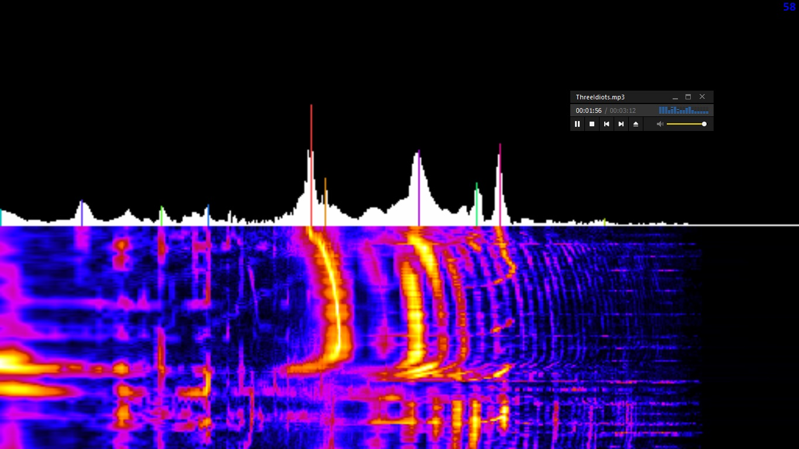

# MusGen
This is an application to analyse and generate sound, change voice, and generate music.  
It is in development right now.  
Now it can draw spectrum in realtime. From everywhere.  
From audioplayer, from youtube, or from microphone.
  
  
  
  
Author: vk.com/kesha_two