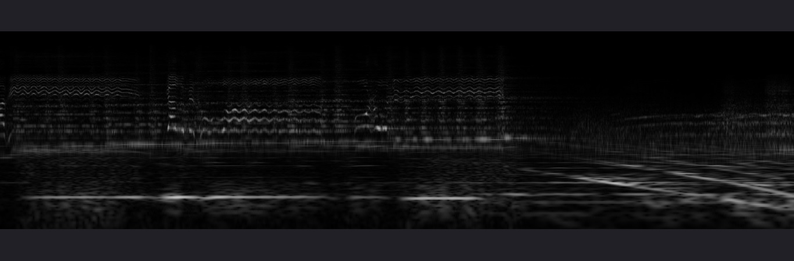

# MusGen
This is an application for analysing, processing and generating sound.  
It is in development right now.  
Now it can draw spectrum in realtime. From everywhere.  
From audioplayer, from youtube, or from microphone.  
Available some audio effects.  
Also you can export wav to jpg and jpg to wav.  
  
  
  
  
  
  
Author: vk.com/kesha_two